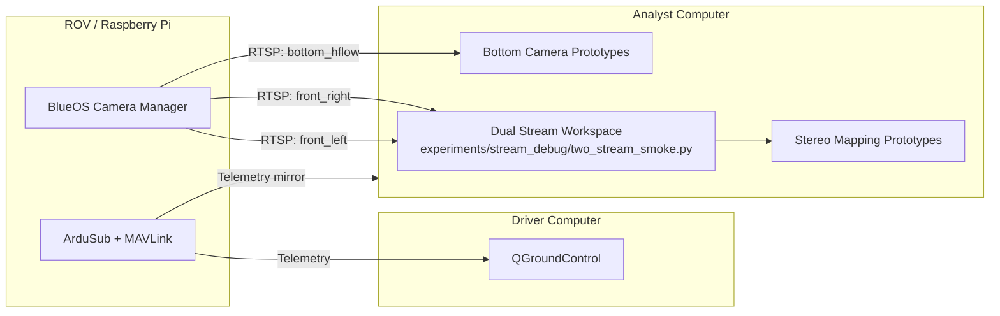
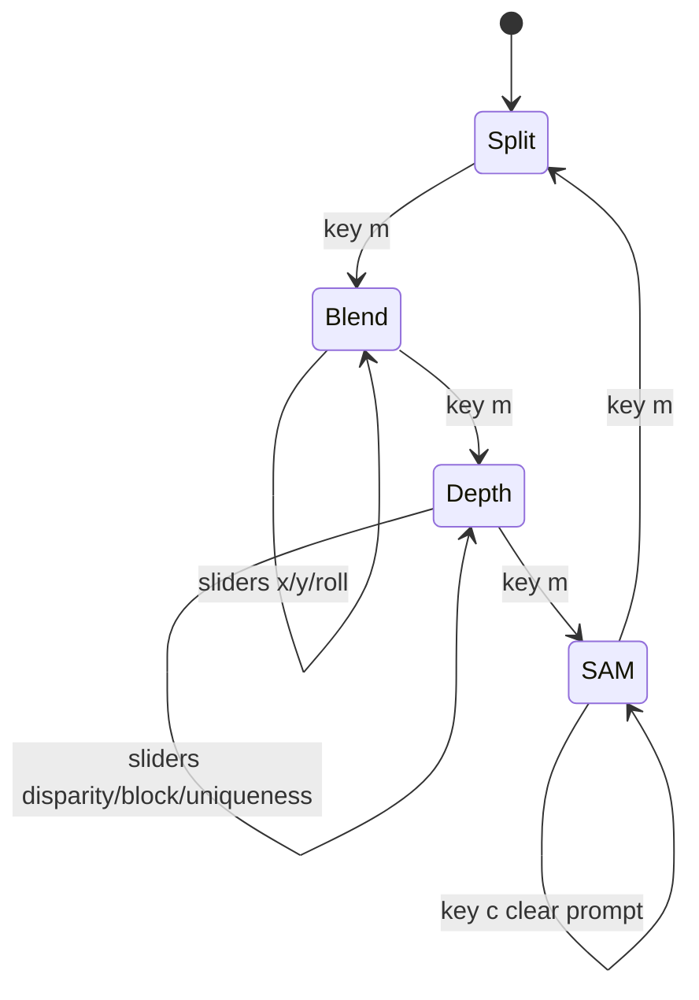
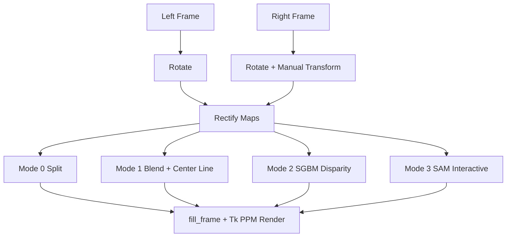

# Crush_2026

Crush_2026 is now organized around the three topside-assisted capabilities you described instead of a flat collection of one-off scripts:

- bottom-camera crab detection on the analyst computer
- depth-hold and loiter support driven primarily by the depth sensor, with bottom-camera and optical-flow context
- stereo depth and optional 3D scene layout from the two front cameras

The Raspberry Pi running BlueOS and ArduSub stays responsible for vehicle control, telemetry, and video publishing. The heavier compute work lives on the analyst computer so the driver computer can stay focused on QGroundControl and pilot-facing tools.

## Latest Advancements (June 2026)

- Added a stable dual-stream Tkinter workspace prototype with live BlueOS front-camera ingest.
- Added live mode toggling in the stream workspace:
  - split channels
  - flattened blend for alignment checks
  - grayscale depth map using SGBM
  - interactive SAM segmentation mode
- Added manual right-camera alignment controls (X shift, Y shift, roll) for fast field calibration.
- Added live stereo matching tuning controls (disparity range, block size, uniqueness).
- Added SAM inference throttling for lower CPU load in interactive mode.

## Current Runtime Graph



## Stream Workspace Mode Graph



## Stereo + SAM Processing Graph



## Host Split

- ROV / Raspberry Pi: BlueOS, ArduSub, camera publishing, telemetry transport, H-flow extension
- Driver computer: QGroundControl, vehicle status, pilot mode selection, forwarded preview streams
- Analyst computer: crab detector HUD, stereo mapping feed, local logging, heavier perception workloads

## Repository Layout

```text
Crush_2026/
    configs/
        streams.example.yaml
    docs/
        architecture.md
    experiments/
        bottom_camera/
            dark_spot_detector.py
            hsv_crab_detector.py
        front_stereo/
            README.md
            stereo_depth_mapping.py
        stream_debug/
            rtsp_yolo_probe.py
            two_stream_smoke.py
    src/
        crush_2026/
            shared/
            vehicle/
            topside/
                streaming/
                perception/
                depth_hold/
                mapping/
    README.md
    requirements.txt
```

## Why This Structure

- `src/crush_2026/vehicle`: onboard-facing integration points and future BlueOS or ArduSub interfaces
- `src/crush_2026/topside/streaming`: stream discovery, RTSP ingest, routing, and preview surfaces
- `src/crush_2026/topside/perception`: bottom-camera crab-detection pipelines and mission-object logic
- `src/crush_2026/topside/depth_hold`: depth-sensor, optical-flow, and bottom-camera assisted hold logic
- `src/crush_2026/topside/mapping`: stereo calibration, disparity, depth maps, and 3D layout experiments
- `src/crush_2026/shared`: stream roles, host config, and any shared data contracts
- `experiments/`: disposable prototypes and calibration utilities that should not define the final architecture

## Current Prototype Placement

- `experiments/bottom_camera/dark_spot_detector.py`: generic dark-blob detector prototype for the downward-facing camera task surface
- `experiments/bottom_camera/hsv_crab_detector.py`: HSV-based printed-crab detector prototype for the downward-facing camera
- `experiments/front_stereo/stereo_depth_mapping.py`: front stereo-pair SGBM depth-map prototype for the analyst computer
- `experiments/stream_debug/rtsp_yolo_probe.py`: single-stream BlueOS RTSP smoke test
- `experiments/stream_debug/two_stream_smoke.py`: dual-stream Tkinter workspace with live alignment, depth, and SAM interactive segmentation modes

## Development Order

1. Build a stable three-stream ingest layer from BlueOS into the analyst computer.
2. Replace the prototype bottom-camera logic with a modular crab-detection pipeline.
3. Integrate depth-sensor and optical-flow inputs for depth-hold and loiter assistance.
4. Add stereo calibration and disparity from the two front cameras for a depth map and optional 3D layout.

The 3D layout work is useful if you want range estimates, obstacle awareness, and richer scene context, but it should remain independent of bottom-camera crab detection. The first milestone should be reliable ingest and crab detection on the downward-facing stream.

See `docs/architecture.md` for the detailed system split and `configs/streams.example.yaml` for the three-camera role model.
