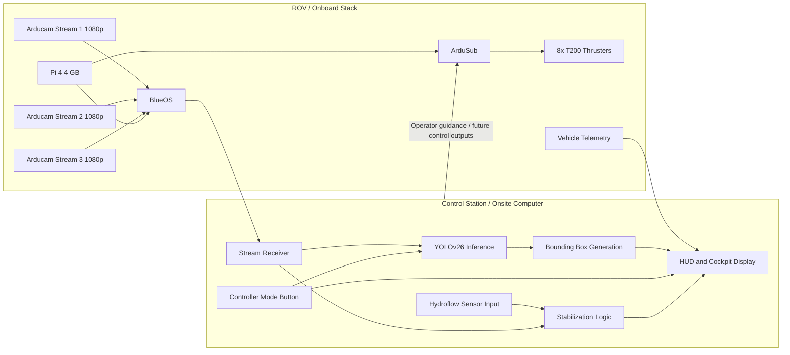

# Crush 2026 Architecture

This README describes the system architecture for the Crush_2026 rover iteration. The goal of this stack is to keep low-level vehicle control on the rover, move heavier perception workloads to the control station, and present a unified operator view through the cockpit HUD.

## System Summary

- Vehicle compute: Raspberry Pi 4 with 4 GB RAM
- Vehicle software: BlueOS with ArduSub
- Propulsion: 8x Blue Robotics T200 thrusters
- Vision payload: 3x 1080p Arducam video streams
- Perception host: control station computer running YOLOv26 inference
- Operator interface: cockpit software with HUD overlays and a controller-triggered detection mode
- Stabilization inputs: hydroflow sensor data plus camera-derived information processed on the onsite computer

## Architectural Intent

The Crush_2026 architecture splits the system into two major domains:

1. The rover handles real-time vehicle control, actuation, camera capture, and telemetry transport.
2. The control station handles compute-heavy vision inference, operator display, higher-level perception logic, and stabilization assistance.

This division keeps the Pi 4 focused on deterministic onboard functions while allowing the topside system to scale object detection and interface rendering without overloading vehicle compute.

## High-Level Architecture

## Subsystems

### 1. Onboard Vehicle Layer

The rover is built around a Raspberry Pi 4 with 4 GB of RAM. That Pi runs BlueOS and ArduSub, which together provide the onboard runtime for video transport, telemetry, and vehicle control.

Responsibilities of the onboard layer:

- Host the vehicle software stack
- Interface with the 8 T200 thrusters through ArduSub
- Capture and publish the three 1080p camera feeds
- Forward telemetry and other runtime data to the control station
- Remain focused on low-level, timing-sensitive behavior instead of heavy inference

### 2. Propulsion and Control Layer

ArduSub is the core motion-control component in this iteration. It is responsible for converting pilot or autonomy commands into thruster outputs for the 8 T200 thrusters.

This layer should be treated as the authoritative control plane for:

- Thruster mixing
- Vehicle motion commands
- Stability-critical actuation
- Integration point for future assisted or autonomous corrections

### 3. Video and Perception Layer

Three 1080p Arducam feeds are streamed off the rover through BlueOS and received on the control station. Those streams are the primary perception inputs for the system.

On the control station:

- YOLOv26 runs inference on incoming video
- Detected objects are converted into bounding boxes
- Annotated video can be displayed inside the cockpit software
- Detection results can later feed guidance, tracking, or mission-specific autonomy behaviors

The existing prototype in [stream_spy_main_test.py](stream_spy_main_test.py) already reflects this architectural split: it receives an RTSP stream from BlueOS, runs YOLO-based inference on the surface-side machine, and overlays detections for display.

### 4. Operator Interface Layer

The cockpit software is the operator-facing view of the system. It acts as the display surface for:

- Live camera feeds
- Detection overlays and bounding boxes
- Vehicle telemetry
- Stabilization-related state
- Any mission HUD elements needed by the operator

A controller mode button is intended to switch the cockpit into detection mode. In that mode, the operator can view the perception-enhanced streams instead of a plain video feed.

### 5. Stabilization and Sensor Fusion Layer

Hydroflow sensor data is routed to the onsite computer, where it is combined with camera information to support stabilization logic. This makes the stabilization loop a topside-assisted feature rather than a purely onboard process.

Inputs into this layer:

- Hydroflow sensor data
- Camera-derived information
- Potentially vehicle telemetry from the ROV

Outputs from this layer:

- Stabilization state shown on the HUD
- Future recommendations or corrections that can be sent back into the control stack

## Data Flow

### Camera and Detection Flow

1. Arducam sensors capture three 1080p views on the rover.
2. BlueOS publishes those feeds for transport to the control station.
3. The control station receives the streams and runs YOLOv26 inference.
4. Detections are transformed into bounding boxes and overlays.
5. The processed video is shown in cockpit software.
6. Detection mode is enabled through a controller mode button.

### Stabilization Flow

1. Hydroflow sensor data arrives at the onsite computer.
2. Camera information is processed alongside that sensor data.
3. Stabilization logic derives guidance or state estimates.
4. The resulting information is presented on the HUD.
5. Future iterations can route those outputs into assisted control behaviors.

### Control Flow

1. Operator commands originate from the controller.
2. ArduSub remains responsible for converting commands into thruster outputs.
3. Any future autonomy or perception-assisted corrections should integrate through the ArduSub control path rather than bypassing it.

## Design Boundaries

For Crush_2026, the system should be understood through these boundaries:

- Onboard side: deterministic control, streaming, telemetry, camera acquisition
- Topside side: inference, display, sensor fusion, higher-level stabilization logic
- Shared interface: telemetry, video streams, and control messages between rover and control station

This separation is important because the Pi 4 is adequate for vehicle operations and streaming, but the heavier vision workload is more appropriate for the control station computer.

## Current Implementation Note

The current repository content in this iteration is a vision-stream prototype rather than the full rover stack. The prototype demonstrates:

- Connection to a BlueOS RTSP video stream
- Surface-side YOLO inference
- Bounding box rendering on the received video
- A path toward future MAVLink or ArduSub-linked responses

That makes this folder a perception and integration test surface for the broader Crush_2026 architecture described above.
